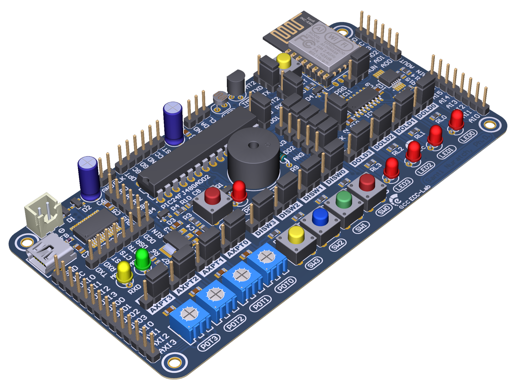
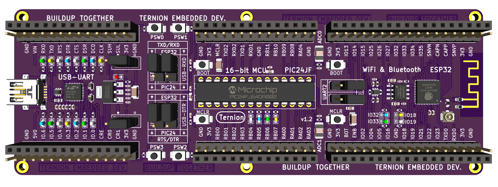

# Embedded-Systems-Development
This repository provides learning resources of the `Embedded Systems Development Tutorials` series

---

## Software Tools

- :floppy_disk: [
ternion_full_installer.zip](https://drive.google.com/file/d/1p5xKjNtWMkip_j8TWxl69MGJGkMsb7DU/view?usp=sharing) This installer includes all you need.

##### *Update:* Three items below are not required  
- :floppy_disk: ~~[ternion_library_installer.zip](https://drive.google.com/file/d/1QA_oE0H3pMjCHzVteBT_uBbI-3yAAMnq/view?usp=sharing) (no update)~~

- :floppy_disk: ~~[ternion_tools_installer.zip](https://drive.google.com/file/d/160y1VxjB0OcvMvXvsZEnk9T65kMawAfG/view?usp=sharing) (last update: 05 March 2024)~~

- :floppy_disk: ~~[All software tools](https://drive.google.com/drive/folders/1Du3LzJ2vCQVqI7TTh7TJsF7wNZv_C8Vi)~~

>Download and install only the `ternion_full_installer`. ~~The `ternion_library_installer` and `ternion_tools_installer` are used to update the `library` and `tools`. If you see `new update`, you can download and install them.~~

## Documents:

:book: [XC16 C Compiler User's Guide](https://ww1.microchip.com/downloads/en/DeviceDoc/MPLAB%20XC16%20C%20Compiler%20Users%20Guide%20DS50002071.pdf)

:book: [PIC24FJ64GA004 FAMILY](https://ww1.microchip.com/downloads/aemDocuments/documents/OTH/ProductDocuments/DataSheets/39881e.pdf)

## Videos (YouTube Playlist)

:movie_camera: [Embedded Systems Development](https://www.youtube.com/playlist?list=PLBPFpqyTjzeXu0P0vRzooo-VWmZtSZkAj)

## Development Boards

### DevBoardGen1 (Pioneer)

### DevBoardGen2 (Ternion)

