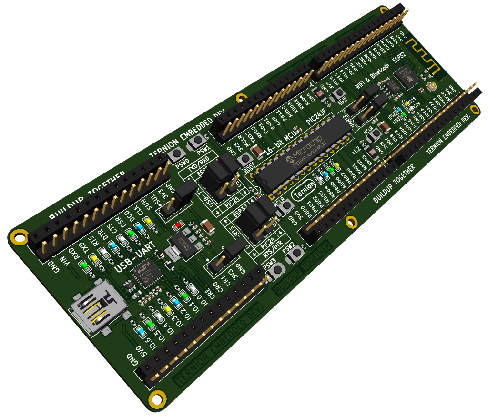

# Embedded-Systems-Development
This repository provides learning resources of the `Embedded Systems Development Tutorials` series

---

## Software Tools

- :floppy_disk: [ternion_full_installer.zip](https://drive.google.com/file/d/1p5xKjNtWMkip_j8TWxl69MGJGkMsb7DU/view?usp=sharing) This installer includes all you need.
  
- :floppy_disk: [ternion_library_installer.zip](https://drive.google.com/file/d/1QA_oE0H3pMjCHzVteBT_uBbI-3yAAMnq/view?usp=sharing) (no update)

- :floppy_disk: [ternion_tools_installer.zip](https://drive.google.com/file/d/160y1VxjB0OcvMvXvsZEnk9T65kMawAfG/view?usp=sharing) (last update: 05 March 2024)

>Download and install only the `ternion_full_installer`. The `ternion_library_installer` and `ternion_tools_installer` are used to update the `library` and `tools`. If you see `new update`, you can download and install them.

## Documents:

>Will be provided later

## Videos (YouTube)

:movie_camera: [EP01: Introduction to this series](https://youtu.be/R_Hrb4gQyqM)

:movie_camera: [EP02: Development Boards and Learning Resources](https://youtu.be/EwJMqaTC3D0)

:movie_camera: [EP03: Download and Install the TernionDevTools](https://youtu.be/reyd67Kq404)

:movie_camera: [EP04: Download and Install VSCode](https://youtu.be/Z9Q771oWSYI)

:movie_camera: [EP05: Checking the Development Board](https://youtu.be/G7Cq0YQgtoo)

:movie_camera: [EP06: Create a New Ternion Project](https://youtu.be/1ZyPyZuMCwA)

:movie_camera: [EP07:  Firmware Development Workflow](https://youtu.be/DiKG8eBf54Y)

:movie_camera: [EP08:  Periodic Operation and Blinking LED](https://youtu.be/vuMPcCpqx5k)

>Other videos will be updated soon.

## Development Boards

### DevBoardGen1 (Pioneer)

### DevBoardGen2 (Ternion)

